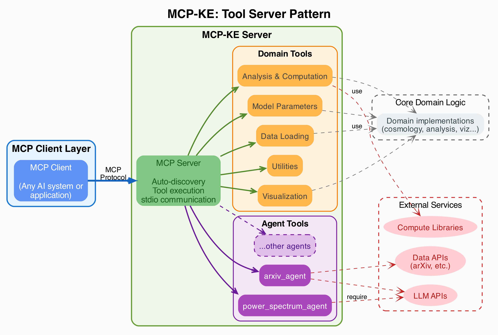
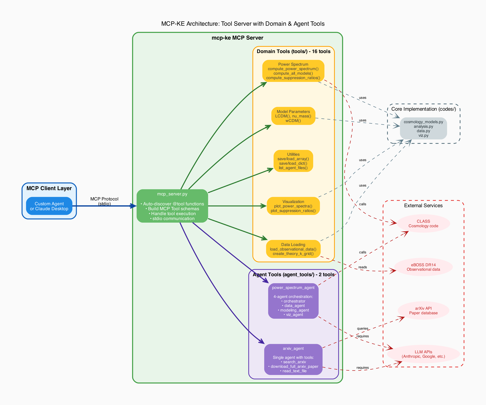

# MCP-KE Architecture

## High-Level Design

MCP-KE follows a tool server pattern where domain-specific cosmology analysis capabilities are exposed through the Model Context Protocol (MCP).

### Abstract Architecture



The abstract architecture diagram above shows the high-level tool server pattern with MCP client layer, server core, domain tools, agent tools, core implementations, and external services.

### Complete System Architecture



The detailed architecture diagram shows all components, tools, and external dependencies.

### Architecture Summary

```
┌─────────────────────────────────────────────────────────────┐
│                      MCP Client Layer                        │
│  (Claude Desktop, custom agentic systems, etc.)             │
└────────────────────────┬────────────────────────────────────┘
                         │ MCP Protocol (stdio)
┌────────────────────────▼────────────────────────────────────┐
│                    mcp_server.py                             │
│  • Auto-discovers @tool decorated functions                 │
│  • Converts to MCP Tool objects with JSON schemas           │
│  • Handles tool execution and error handling                │
└────────────┬───────────────────────────────┬────────────────┘
             │                               │
    ┌────────▼────────┐           ┌─────────▼──────────┐
    │  Domain Tools   │           │   Agent Tools      │
    │   (tools/)      │           │  (agent_tools/)    │
    │                 │           │                    │
    │  16 tools for:  │           │  2 orchestrators:  │
    │  • Data loading │           │  • power_spectrum  │
    │  • Cosmology    │           │  • arxiv_agent     │
    │    models       │           │                    │
    │  • Power        │           │  Each runs its own │
    │    spectrum     │           │  multi-agent system│
    │    computation  │           │  internally        │
    │  • Plotting     │           │                    │
    └─────────────────┘           └────────────────────┘
```

## Component Architecture

### 1. MCP Server (`mcp_server.py`)

**Purpose**: Bridge between MCP protocol and Python tool functions

**Key Mechanisms**:

**Tool Discovery**:
```python
def discover_tools() -> dict[str, callable]:
    """
    Walks through tools/ and agent_tools/ packages
    Finds all @tool decorated functions
    Returns dict mapping tool names to callables
    """
```

Discovery process:
1. Uses `pkgutil.walk_packages()` to traverse `tools/` and `agent_tools/`
2. Uses `inspect.getmembers()` to find decorated functions
3. Checks for `__wrapped__` or `name` attributes (smolagents @tool pattern)
4. Builds tool registry automatically

**MCP Tool Schema Builder**:
```python
def build_mcp_tool(name: str, func: callable) -> Tool:
    """
    Converts Python function to MCP Tool with JSON schema
    Extracts: docstring, parameters, type annotations
    Generates: MCP-compliant tool description
    """
```

**MCP Endpoints**:
- `@app.list_tools()`: Returns all discovered tools with schemas
- `@app.call_tool()`: Executes tool and returns result as TextContent

**Communication**: Runs on stdio - stdin/stdout pipes managed by MCP client

### 2. Domain Tools (`tools/`)

**Purpose**: Atomic operations for cosmology analysis

Domain tools are thin wrappers around `codes/` implementations. They provide:
- Data loading (eBOSS DR14, k-grids)
- Model parameters (ΛCDM, massive neutrinos, dark energy)
- Analysis (power spectrum computation, suppression ratios)
- Visualization (comparison plots)
- Utilities (file I/O, persistence)

See **[02a_TOOLS.md](02a_TOOLS.md)** for complete tool reference.

### 3. Agent Tools (`agent_tools/`)

**Purpose**: Multi-agent workflows exposed as single tools

Agent tools encapsulate complex, multi-step workflows:
- **power_spectrum_agent**: 4-agent hierarchical orchestration for full analysis
- **arxiv_agent**: Literature search and paper analysis

See **[02a_TOOLS.md](02a_TOOLS.md)** for detailed agent tool documentation.

### 4. Core Implementations (`codes/`)

**Purpose**: Domain logic separate from tool interfaces

**Modules**:
- `cosmology_models.py`: Parameter dict builders for CLASS
- `analysis.py`: CLASS wrapper for power spectrum computation
- `data.py`: File I/O for observational data
- `viz.py`: Matplotlib plotting functions

**Design Rationale**:
- Reusable outside MCP context
- Testable independently
- Can be used directly by Python scripts

### 5. Utilities (`mcp_utils/`)

**path_utils.py**:
```python
def get_output_path(filename: str) -> str:
    """
    Handles output directory logic:
    - Bare filename → prepend 'out/'
    - Absolute path or with separator → use as-is
    - Creates output directory if needed
    """

def get_input_path(filename: str) -> str:
    """Similar logic for input/ directory"""
```

**Purpose**: Consistent path handling across all tools

## Communication Flow

### Client-Server Interaction

```
┌───────────────────┐                           ┌──────────────────┐
│  MCP Client       │                           │  mcp_server.py   │
└─────────┬─────────┘                           └────────┬─────────┘
          │                                              │
          │  1. Launch subprocess                        │
          ├─────────────────────────────────────────────►│
          │     command: python mcp_server.py            │
          │                                              │
          │  2. MCP handshake (stdio)                    │
          │◄────────────────────────────────────────────►│
          │                                              │
          │  3. list_tools()                             │
          ├─────────────────────────────────────────────►│
          │                                              │
          │  4. [Tool schemas: 23 tools]                 │
          │◄─────────────────────────────────────────────┤
          │                                              │
          │                                              │
User asks: "Compare ΛCDM with massive neutrino models"   │
          │                                              │
          │  5. call_tool("LCDM", {})                    │
          ├─────────────────────────────────────────────►│
          │                                              │ Executes
          │  6. {h: 0.6766, Omega_b: 0.02242, ...}       │ LCDM()
          │◄─────────────────────────────────────────────┤
          │                                              │
          │  7. call_tool("nu_mass", {sum_mnu_eV: 0.1})  │
          ├─────────────────────────────────────────────►│
          │                                              │ Executes
          │  8. {h: 0.6766, N_ncdm: 1, m_ncdm: 0.1,...}  │ nu_mass()
          │◄─────────────────────────────────────────────┤
          │                                              │
          │  9-N. Additional tool calls...                │
          │                                              │
User sees analysis + embedded plot                       │
```

### Agent Tool Internal Flow

When `power_spectrum_agent` is called, it orchestrates a multi-agent workflow with file-based communication:

```
MCP Client calls tool
    ↓
mcp_server.py:call_tool("power_spectrum_agent", {...})
    ↓
Creates 4 LLM instances (orchestrator + 3 sub-agents)
    ↓
orchestrator coordinates:
    1. data_agent → Load data → Save files → Return paths
    2. modeling_agent → Compute models → Save files → Return paths
    3. viz_agent → Create plots → Save files → Return paths
    ↓
Assemble final report
    ↓
Return to MCP Client
```

**Critical Design Choice**: Agents pass file paths, not data arrays
- Avoids context overflow
- Persistent intermediate results
- Clear data lineage

See **[02a_TOOLS.md](02a_TOOLS.md)** for detailed agent workflows with diagrams.

## Testing Strategy

### Unit Tests

**Domain tools**: `tests/test_domain_tools.py`
```python
def test_LCDM():
    params = LCDM()
    assert params['h'] == 0.6766
    assert 'Omega_b' in params
```

**No API key required** - tests use mocked responses

### Integration Tests

**Agent tools**: `tests/test_agent_tools.py`
```python
@pytest.mark.skipif(not os.getenv("GOOGLE_API_KEY"), reason="API key required")
def test_power_spectrum_agent():
    result = power_spectrum_agent(
        query="Compare ΛCDM with eBOSS data",
        api_key=os.getenv("GOOGLE_API_KEY"),
        llm_url="https://generativelanguage.googleapis.com/v1beta/openai/",
        model_id="gemini-2.0-flash-exp"
    )
    assert "plot" in result.lower()
```

**Requires API key** - tests make real LLM calls

### Running Tests

```bash
# Unit tests only (fast, no API key)
pytest tests/test_domain_tools.py

# All tests (requires GOOGLE_API_KEY)
export GOOGLE_API_KEY="your-key"
pytest tests/ -v
```

## Directory Structure Requirements

MCP-KE expects this working directory layout:

```
/your/working/directory/
├── input/              # Input data files (required)
│   └── DR14_pm3d_19kbins.txt
└── out/                # Output files (created automatically)
    ├── *.npy           # Saved arrays
    ├── *.json          # Saved dicts
    └── *.png           # Plot files
```

Tools automatically create `out/` if missing. You must provide `input/` with data files.
