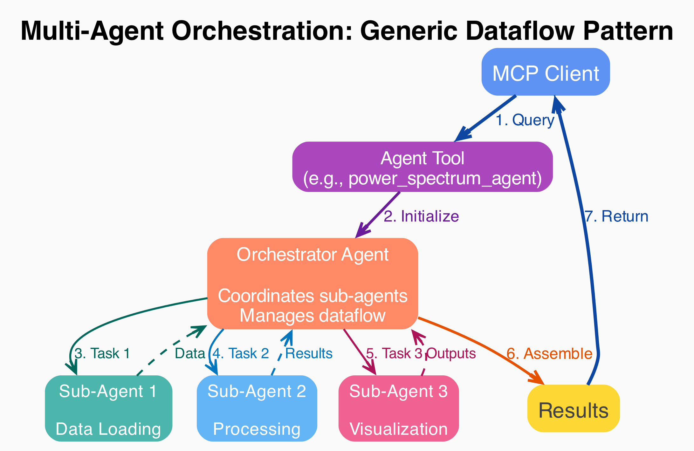

# MCP-KE Tools Reference

This document provides detailed information about all tools available in MCP-KE, including both domain tools and agent tools.

## Overview


The figure above shows the complete architecture with all domain tools and agent tools, their organization, and external dependencies.

## Domain Tools (`tools/`)

**Purpose**: Atomic operations for cosmology analysis

Domain tools are thin wrappers around `codes/` implementations that provide simple, composable operations. They follow this design pattern:

```python
@tool
def tool_name(param: type) -> return_type:
    """
    Detailed docstring (becomes MCP tool description)

    Args:
        param: Description (becomes JSON schema parameter description)

    Returns:
        Description (helps clients understand return values)
    """
    from codes.module import implementation
    return implementation(param)
```

### Data Tools

**`load_observational_data`**
- Load eBOSS DR14 Lyman-alpha forest data
- Input: filename (string)
- Returns: k, P(k), and error arrays
- Location: `tools/data_tools.py`

**`create_theory_k_grid`**
- Generate 300-point logarithmic k-grid
- Range: 0.0001 to 10 h/Mpc
- Returns: NumPy array of k values
- Location: `tools/data_tools.py`

### Model Parameter Tools

Each model tool returns a `dict` of CLASS parameters ready for computation.

**`LCDM()`**
- Returns Planck 2018 baseline cosmology parameters
- Parameters include: h, Omega_b, Omega_cdm, A_s, n_s, tau_reio
- No arguments required
- Location: `tools/model_tools.py`

**`nu_mass(sum_mnu_eV, N_species)`**
- ΛCDM with massive neutrinos
- Args:
  - `sum_mnu_eV`: Sum of neutrino masses in eV
  - `N_species`: Number of massive neutrino species (default: 1)
- Returns: ΛCDM parameters + neutrino parameters
- Location: `tools/model_tools.py`

**`wCDM(w0)`**
- Dark energy with constant equation of state
- Args:
  - `w0`: Dark energy equation of state parameter
- Returns: ΛCDM parameters with w0_fld parameter
- Location: `tools/model_tools.py`

### Analysis Tools

**`compute_power_spectrum(params, k_values)`**
- Compute single model P(k) via CLASS
- Args:
  - `params`: Dictionary of CLASS parameters
  - `k_values`: Array of k values at which to compute P(k)
- Returns: P(k) array
- Location: `tools/analysis_tools.py`

**`compute_all_models(k_values, models)`**
- Batch compute multiple cosmology models
- Args:
  - `k_values`: Array of k values
  - `models`: Dictionary mapping model names to parameter dicts
- Returns: Dictionary mapping model names to P(k) arrays
- Location: `tools/analysis_tools.py`

**`compute_suppression_ratios(model_results, k_values, reference_model)`**
- Calculate P(k)/P_ref(k) for suppression analysis
- Args:
  - `model_results`: Dict of model P(k) results
  - `k_values`: Array of k values
  - `reference_model`: Name of reference model (typically "LCDM")
- Returns: Dictionary of suppression ratios
- Location: `tools/analysis_tools.py`

### Visualization Tools

**`plot_power_spectra(k_theory, model_results, k_obs, Pk_obs, σPk_obs)`**
- Create two-panel comparison plot
- Top panel: P(k) vs k for theory and observations
- Bottom panel: Residuals (theory - observations)
- Args:
  - `k_theory`: Theory k values
  - `model_results`: Dict of model P(k) arrays
  - `k_obs`: Observational k values
  - `Pk_obs`: Observational P(k) values
  - `σPk_obs`: Observational errors
- Returns: Path to saved PNG file
- Location: `tools/viz_tools.py`

**`plot_suppression_ratios(k_values, suppression_ratios)`**
- Plot P(k)/P_LCDM(k) for all models
- Args:
  - `k_values`: Array of k values
  - `suppression_ratios`: Dict of suppression ratio arrays
- Returns: Path to saved PNG file
- Location: `tools/viz_tools.py`

### Helper Tools

**`save_array(array, filename)`**
- Save NumPy array to file
- Uses `.npy` format
- Automatically adds `out/` prefix if needed
- Location: `tools/io_tools.py`

**`load_array(filename)`**
- Load NumPy array from file
- Returns: NumPy array
- Location: `tools/io_tools.py`

**`save_dict(data, filename)`**
- Save dictionary to JSON file
- Args:
  - `data`: Dictionary to save
  - `filename`: Output filename (`.json` extension)
- Location: `tools/io_tools.py`

**`load_dict(filename)`**
- Load dictionary from JSON file
- Returns: Python dictionary
- Location: `tools/io_tools.py`

**`list_agent_files(directory)`**
- List all files in a directory (typically `out/`)
- Returns: List of filenames
- Location: `tools/io_tools.py`

## Agent Tools (`agent_tools/`)

**Purpose**: Multi-agent workflows exposed as single tools

Agent tools encapsulate complex, multi-step workflows that would be tedious to orchestrate manually. They use smolagents' `CodeAgent` framework to coordinate multiple LLM-powered agents.

### `power_spectrum_agent`

**Architecture**: 4-agent hierarchical system



The figure above shows the complete internal workflow of the power_spectrum_agent, including all sub-agents and file-based communication.

**Function Signature**:
```python
power_spectrum_agent(
    query: str,
    api_key: str,
    llm_url: str,
    model_id: str
) -> str
```

**Arguments**:
- `query`: Natural language description of analysis task
- `api_key`: API key for LLM service
- `llm_url`: LLM API endpoint URL
- `model_id`: LLM model identifier

**Internal Agent Structure**:

1. **orchestrator_agent** (Coordinator)
   - Manages workflow between sub-agents
   - Extracts and passes file paths
   - Assembles final report

2. **data_agent** (Data Loading)
   - Tools: `load_observational_data`, `save_array`, `save_dict`
   - Task: Load eBOSS DR14 data
   - Output: Saves k_obs.npy, Pk_obs.npy, errors_obs.npy
   - Returns file paths to orchestrator

3. **modeling_agent** (Theory Computation)
   - Tools: `LCDM`, `nu_mass`, `wCDM`, `create_theory_k_grid`, `compute_all_models`, `compute_suppression_ratios`, `load_array`, `save_array`, `load_dict`, `save_dict`
   - Task: Compute theoretical P(k) for requested models
   - Output: Saves k_theory.npy, model_results.json
   - Returns file paths to orchestrator

4. **viz_agent** (Visualization)
   - Tools: `plot_power_spectra`, `plot_suppression_ratios`, `load_array`, `load_dict`
   - Task: Create comparison visualizations
   - Output: Saves plot PNG files
   - Returns file paths to orchestrator

**Workflow**:
```
User Query → Orchestrator
    ↓
    ├─► Data Agent → Load eBOSS data → Save to files → Return paths
    ↓
    ├─► Modeling Agent → Compute models → Save results → Return paths
    ↓
    └─► Viz Agent → Create plots → Save images → Return paths
    ↓
Final Report with all file paths
```

**Key Design Feature**: File-based communication
- Agents pass file paths, not large data arrays
- Prevents context overflow
- Persistent intermediate results for debugging
- Clear data lineage

**Example Usage**:
```python
result = power_spectrum_agent(
    query="Compare ΛCDM, massive neutrino (0.1 eV), and wCDM (w=-0.9) models with eBOSS data",
    api_key=os.getenv("GOOGLE_API_KEY"),
    llm_url="https://generativelanguage.googleapis.com/v1beta/openai/",
    model_id="gemini-2.0-flash-exp"
)
```

**Location**: `agent_tools/power_spectrum_agent.py`

### `arxiv_agent`

**Architecture**: Single agent with specialized tools

**Function Signature**:
```python
arxiv_agent(
    query: str,
    api_key: str,
    llm_url: str,
    model_id: str
) -> str
```

**Arguments**:
- `query`: Research question or topic to search
- `api_key`: API key for LLM service
- `llm_url`: LLM API endpoint URL
- `model_id`: LLM model identifier

**Internal Tools**:
- `search_arxiv(query, max_results, sort_by)`: Search arXiv database
- `download_arxiv_paper(paper_id, output_dir)`: Download paper abstract
- `download_full_arxiv_paper(paper_id, output_dir)`: Download PDF and extract text
- `read_text_file(filepath)`: Read extracted paper text
- `list_files(directory)`: List downloaded files

**Workflow** (encoded in agent instructions):
1. Search arXiv for papers matching query
2. Identify 2-3 most relevant papers from abstracts
3. Download PDFs and extract to text
4. Read text files to extract key information
5. Return summaries with file paths and citations

**Example Usage**:
```python
result = arxiv_agent(
    query="Recent constraints on neutrino masses from cosmology",
    api_key=os.getenv("GOOGLE_API_KEY"),
    llm_url="https://generativelanguage.googleapis.com/v1beta/openai/",
    model_id="gemini-2.0-flash-exp"
)
```

**Location**: `agent_tools/arxiv_agent.py`

## Why Agent Tools?

1. **Complex Orchestration**: Multi-step workflows with conditional logic
2. **Context Management**: Agents handle intermediate results, only return final outputs
3. **Error Recovery**: Agents can retry, adapt strategies if tools fail
4. **Natural Language Interface**: Takes freeform queries, not structured parameters
5. **Reduced Client Burden**: Client doesn't need to understand workflow details

## Tool Discovery

All tools are automatically discovered by the MCP server via the `@tool` decorator. No manual registration is required.

**Discovery Process**:
1. Server walks through `tools/` and `agent_tools/` packages
2. Finds all functions decorated with `@tool`
3. Extracts docstrings and type annotations
4. Builds JSON schemas for MCP protocol
5. Exposes tools to MCP clients

See `mcp_server.py:discover_tools()` for implementation details.
